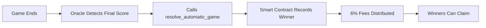

The Dubs Oracle is an automated service that bridges real-world sports results with your on-chain bets. It continuously monitors live sports scores and automatically resolves games when events finish—no human intervention required.

## How It Works

<Steps>
  <Step title="Monitor">
    Oracle polls live sports APIs every 60 seconds
  </Step>
  <Step title="Detect">
    When a game ends, oracle detects the final score
  </Step>
  <Step title="Resolve">
    Calls `resolve_automatic_game` on the Solana smart contract
  </Step>
  <Step title="Distribute">
    Fees are deducted and winners can claim their payouts
  </Step>
</Steps>

## Data Sources

<CardGroup cols={2}>
  <Card>
    

    **Score Resolution (Authoritative)**

    All outcome-determining scores come exclusively from ESPN APIs. Supports NFL, NBA, MLB, NHL, and College sports.
  </Card>
  <Card title="TheSportsDB" icon="database">
    **Event Metadata**

    Team names, schedules, and logos come from TheSportsDB. This data is for display only—not used for resolution.
  </Card>
</CardGroup>

## What the Oracle Monitors

Every 60 seconds, the oracle checks:

| Data Point | Source |
|------------|--------|
| Pending games | PostgreSQL database |
| Live scores | ESPN APIs |
| Game status | ESPN (in progress, final, postponed) |
| Final scores | ESPN |

## Resolution Process

When a sports game finishes:



### Fee Distribution on Resolution

| Recipient | Percentage | Notes |
|-----------|------------|-------|
| Dubs (Operator) | 4-5% | 4% if referrer exists, 5% otherwise |
| Referrer | 0-1% | 1% if game creator was referred |
| Oracle | 1% | Self-funding for operations |

## Oracle Wallet

<Warning>
**Hardcoded Address — Cannot Be Changed**

```
FWUJCthDfPcgmTvdQWM5uofxxiYjqJFMMwiLYvS7LBFa
```

This address is hardcoded in the smart contract. It's the **only** wallet authorized to resolve automatic sports games.
</Warning>

## Safety Features

<AccordionGroup>
  <Accordion title="Emergency Refund" icon="life-ring">
    If the oracle fails to resolve a game within **24 hours** of lock time, anyone can trigger an emergency refund. This returns all stakes to players with no fees.

    This ensures funds are never permanently locked, even if the oracle goes offline.
  </Accordion>

  <Accordion title="Self-Funding" icon="gas-pump">
    The oracle receives a 1% fee from each resolved game. This covers Solana transaction costs, ensuring the system can operate indefinitely without external funding.
  </Accordion>

  <Accordion title="Early Resolution Protection" icon="shield">
    The smart contract prevents the oracle from resolving games **before the lock time passes**. This ensures no one can manipulate results before the actual game finishes.

    Even if the oracle is compromised, it cannot resolve a game early.
  </Accordion>
</AccordionGroup>

## Trust Model

<Info>
The oracle is a **trusted** component of the system. It has the power to determine game outcomes.

However, multiple safeguards limit potential abuse:
- Hardcoded wallet address (can't be changed)
- Lock time enforcement (can't resolve early)
- Emergency refunds (funds never locked forever)
- On-chain transparency (all resolutions are public)
</Info>

## Technical Details

| Property | Value |
|----------|-------|
| Poll Interval | 60 seconds |
| Data Source | ESPN APIs (authoritative) |
| Emergency Refund | 24 hours after lock time |
| Fee | 1% of prize pool |
| Wallet | `FWUJCthDfPcgmTvdQWM5uofxxiYjqJFMMwiLYvS7LBFa` |
