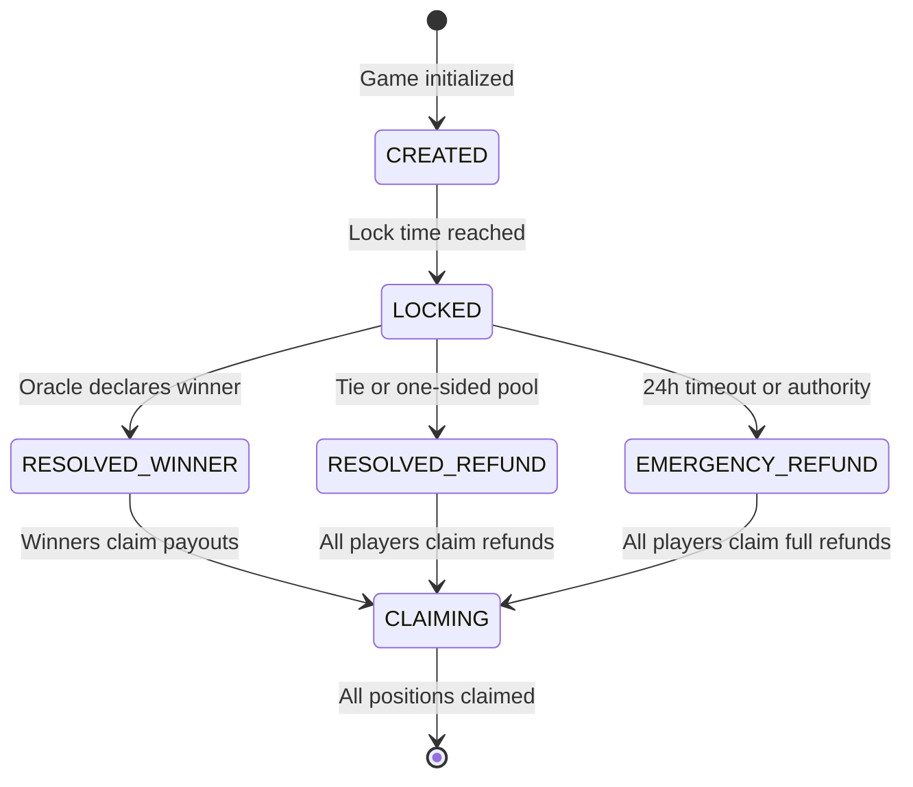
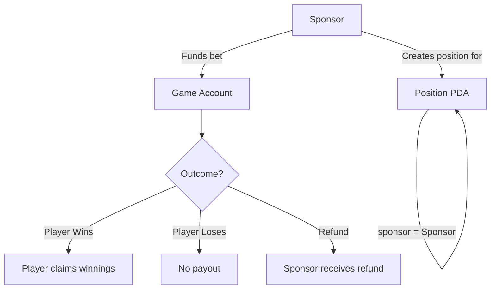

# DUBS V2: Pool-Based Betting Protocol

**Whitepaper v1.0** | January 2025

---

## Table of Contents

1. [Introduction](#1-introduction)
2. [System Overview](#2-system-overview)
3. [Core Concepts](#3-core-concepts)
4. [Account Architecture](#4-account-architecture)
5. [Game Lifecycle](#5-game-lifecycle)
6. [Fee Structure](#6-fee-structure)
7. [Payout Mechanics](#7-payout-mechanics)
8. [Sponsored Betting](#8-sponsored-betting)
9. [Emergency Mechanisms](#9-emergency-mechanisms)
10. [Edge Cases](#10-edge-cases)
11. [Security Model](#11-security-model)
12. [Technical Specifications](#12-technical-specifications)

---

## 1. Introduction

DUBS V2 is a decentralized pool-based (pari-mutuel) betting protocol built on Solana. It enables trustless, transparent wagering on sports events with automatic, proportional payouts to winners.

### 1.1 Design Philosophy

- **Trustless**: No custody of funds by operators; all funds held in program-derived accounts
- **Transparent**: All pool sizes, stakes, and payouts verifiable on-chain
- **Scalable**: Position PDA architecture supports unlimited participants per game
- **Fair**: Proportional payouts ensure mathematical fairness regardless of pool imbalance
- **Resilient**: Multiple emergency mechanisms prevent permanent fund lockup

### 1.2 Key Features

| Feature | Description |
|---------|-------------|
| Pool-Based Payouts | Winners share the pool proportionally based on stake |
| Variable Stakes | Any positive amount accepted (no fixed buy-in) |
| Three Outcomes | Home, Away, and Draw as first-class betting options |
| Position PDAs | One account per player per game for scalability |
| Referral System | 1% commission for referrers who bring players |
| Sponsored Betting | Third parties can fund bets on behalf of players |
| Emergency Refunds | Multiple fail-safes to protect player funds |

---

## 2. System Overview

### 2.1 Participants

<CardGroup cols={3}>
  <Card title="Player" icon="user">
    Stakes SOL, claims payouts, wins or loses based on outcomes
  </Card>
  <Card title="Operator" icon="gear">
    Creates games, earns 4-5% fee
  </Card>
  <Card title="Oracle" icon="eye">
    Resolves game outcomes, earns 1% fee
  </Card>
  <Card title="Referrer" icon="share">
    Brings players, earns 1% commission
  </Card>
  <Card title="Sponsor" icon="gift">
    Funds bets on behalf of players
  </Card>
  <Card title="Authority" icon="shield">
    Emergency controls and overrides
  </Card>
</CardGroup>

### 2.2 How It Works

<Steps>
  <Step title="Game Creation">
    Operator creates a game for a sports event with a lock time
  </Step>
  <Step title="Betting Period">
    Players stake SOL on Home, Away, or Draw outcomes
  </Step>
  <Step title="Lock">
    At lock time, no more bets accepted
  </Step>
  <Step title="Resolution">
    Oracle reports the winning outcome
  </Step>
  <Step title="Claims">
    Winners claim proportional share of the pool
  </Step>
</Steps>

---

## 3. Core Concepts

### 3.1 Pari-Mutuel Betting

Unlike fixed-odds betting where payouts are determined at bet time, pari-mutuel systems pool all stakes together. Winners share the pool proportionally based on their stake in the winning outcome.

<Accordion title="Example Calculation">
```
Game: Team A vs Team B

Pool Totals:
  - Home (Team A): 100 SOL
  - Away (Team B): 50 SOL
  - Draw: 10 SOL
  - Total Pool: 160 SOL

After 6% fee: Net Pool = 150.4 SOL

If Home wins:
  - Player who staked 10 SOL on Home
  - Payout = (10 / 100) × 150.4 = 15.04 SOL
  - Profit = 15.04 - 10 = 5.04 SOL (50.4% return)
```
</Accordion>

### 3.2 Implied Odds

The pool ratios create dynamic, market-driven odds:

```
Implied Probability = Outcome Pool / Total Pool
```

**Example:**
| Outcome | Pool | Implied Probability |
|---------|------|---------------------|
| Home | 100 SOL | 62.5% |
| Away | 50 SOL | 31.25% |
| Draw | 10 SOL | 6.25% |

### 3.3 Position PDAs

Each player's stake is recorded in a unique Program Derived Address (PDA):

```
Seeds: ["position", game_pubkey, player_pubkey]
```

This architecture:
- Enables unlimited participants per game
- Prevents vector growth attacks
- Allows parallel claim processing
- Provides clear ownership verification

---

## 4. Account Architecture

### 4.1 GameV2 Account

The central game account holding all pool funds and state.

```rust
pub struct GameV2 {
    // Identity
    pub game_id: u64,              // Unique identifier
    pub authority: Pubkey,          // Game creator
    pub operator_wallet: Pubkey,    // Fee recipient (hardcoded)
    pub oracle: Pubkey,             // Resolution authority (hardcoded)

    // Pool State
    pub pool_totals: [u64; 3],      // [Home, Away, Draw] in lamports
    pub total_pool: u64,            // Sum of all pools
    pub position_count: u32,        // Number of positions created

    // Event Metadata
    pub sports_event_id: String,    // External event reference (max 50 chars)
    pub lock_timestamp: i64,        // Unix timestamp when betting closes

    // Game State
    pub is_locked: bool,            // Betting closed
    pub is_resolved: bool,          // Outcome determined
    pub winning_outcome: Option<u8>,// 0=Home, 1=Away, 2=Draw, None=Refund

    // Financial
    pub fees_collected: bool,       // Fees transferred to recipients
    pub net_pool: u64,              // Pool after fees (for payout calc)

    // Optional
    pub sponsor_wallet: Option<Pubkey>,  // If game has sponsored positions
    pub is_emergency_refund: bool,       // True if emergency refund triggered

    pub bump: u8,                   // PDA bump seed
}
```

**PDA Derivation:**
```
Seeds: ["game_v2", game_id.to_le_bytes()]
```

**Account Size:** ~250 bytes (fixed, no vectors)

### 4.2 Position Account

Individual player stake record.

```rust
pub struct Position {
    pub game: Pubkey,              // Reference to GameV2
    pub player: Pubkey,            // Player wallet
    pub outcome: u8,               // 0=Home, 1=Away, 2=Draw
    pub amount: u64,               // Stake in lamports
    pub claimed: bool,             // Payout claimed
    pub referrer: Option<Pubkey>,  // Referrer for fee sharing
    pub sponsor: Option<Pubkey>,   // Sponsor (if sponsored stake)
    pub bump: u8,                  // PDA bump seed
}
```

**PDA Derivation:**
```
Seeds: ["position", game.key(), player.key()]
```

**Account Size:** ~140 bytes (fixed)

### 4.3 Outcome Enum

```rust
#[repr(u8)]
pub enum Outcome {
    Home = 0,  // Home team / First option
    Away = 1,  // Away team / Second option
    Draw = 2,  // Tie / No winner
}
```

---

## 5. Game Lifecycle

### 5.1 State Machine



### 5.2 Instructions

<AccordionGroup>
  <Accordion title="initialize_automatic_game_v2">
    Creates a new game.

    **Parameters:**
    - `game_id: u64` - Unique identifier
    - `lock_timestamp: i64` - When betting closes (must be ≥2 minutes in future)
    - `sports_event_id: String` - External event reference

    **Validation:**
    - Lock time must be at least 2 minutes in the future
    - Game ID must not already exist
  </Accordion>

  <Accordion title="stake_automatic_game">
    Player places a bet.

    **Parameters:**
    - `game_id: u64` - Game to bet on
    - `outcome: Outcome` - Home, Away, or Draw
    - `amount: u64` - Stake in lamports

    **Effects:**
    1. Transfers `amount` from player to game account
    2. Creates Position PDA for player
    3. Updates pool_totals and total_pool
    4. Increments position_count

    **Validation:**
    - Game not locked or resolved
    - Amount > 0
    - Valid outcome (0, 1, or 2)
  </Accordion>

  <Accordion title="stake_automatic_game_sponsored">
    Sponsor funds a bet on behalf of a player.

    **Parameters:** Same as `stake_automatic_game`

    **Key Difference:**
    - Funds come from sponsor wallet, not player
    - Position.sponsor is set
    - On refund, funds return to sponsor (not player)
    - Player still claims winnings if they win
  </Accordion>

  <Accordion title="resolve_automatic_game_v2">
    Oracle resolves the game outcome.

    **Parameters:**
    - `game_id: u64` - Game to resolve
    - `winning_outcome: Option<Outcome>` - Winner, or None for refund

    **Effects:**
    1. Calculates and transfers fees
    2. Sets winning_outcome and net_pool
    3. Marks game as resolved

    **Validation:**
    - Caller must be the designated oracle
    - Game must be locked (or past lock time)
    - Game not already resolved
  </Accordion>

  <Accordion title="claim_automatic_winnings_v2">
    Player claims their payout.

    **Parameters:**
    - `game_id: u64` - Game to claim from

    **Effects:**
    1. Calculates payout based on outcome
    2. Transfers payout from game to player (or sponsor for refunds)
    3. Marks position as claimed

    **Payout Logic:**
    - **Winner:** Proportional share of net_pool based on stake in winning pool
    - **Loser:** 0 (position still marked claimed)
    - **Refund:** Proportional share based on stake in total pool
  </Accordion>

  <Accordion title="emergency_refund_v2">
    Permissionless emergency refund after 24 hours.

    **Parameters:**
    - `game_id: u64` - Game to refund

    **Validation:**
    - Game is locked but not resolved
    - At least 24 hours have passed since lock time

    **Effects:**
    - Sets winning_outcome = None (refund all)
    - No fees collected
    - All players can claim full refund
  </Accordion>

  <Accordion title="authority_emergency_refund_v2">
    Authority can trigger emergency refund at any time.

    **Validation:**
    - Caller must be program authority
    - Game not already resolved

    **Effects:**
    - Same as emergency_refund_v2
    - No time restriction
  </Accordion>
</AccordionGroup>

---

## 6. Fee Structure

### 6.1 Fee Breakdown

Total fee is **6%** of the distributable pool (pool minus rent reserve).

| Recipient | With Referrer | Without Referrer |
|-----------|---------------|------------------|
| Operator  | 4%            | 5%               |
| Oracle    | 1%            | 1%               |
| Referrer  | 1%            | 0%               |
| **Total** | **6%**        | **6%**           |

### 6.2 Fee Calculation

```rust
fn calculate_fees(distributable: u64, has_referrer: bool) -> FeeBreakdown {
    let total_fee = distributable * 600 / 10_000;  // 6%

    let oracle_fee = distributable * 100 / 10_000;  // 1%

    let (operator_fee, referrer_fee) = if has_referrer {
        (distributable * 400 / 10_000,  // 4%
         distributable * 100 / 10_000)  // 1%
    } else {
        (distributable * 500 / 10_000,  // 5%
         0)
    };

    FeeBreakdown { operator_fee, oracle_fee, referrer_fee, total_fee }
}
```

### 6.3 Rent-First Economics

Fees are calculated on the **distributable** amount, not total pool:

```
Distributable = Game Account Lamports - Rent Reserve

Net Pool = Distributable - Total Fees
```

This ensures the game account remains rent-exempt throughout its lifecycle.

---

## 7. Payout Mechanics

### 7.1 Winner Payout Formula

```
payout = floor(position.amount × net_pool / winning_pool_total)
```

<Accordion title="Winner Example">
```
Net Pool: 94 SOL
Winning Pool (Home): 50 SOL
Player Stake on Home: 10 SOL

Payout = floor(10 × 94 / 50) = floor(18.8) = 18 SOL
Profit = 18 - 10 = 8 SOL (80% return)
```
</Accordion>

### 7.2 Refund Payout Formula

When winning_outcome = None (tie, cancellation, or emergency):

```
payout = floor(position.amount × net_pool / total_pool)
```

<Tabs>
  <Tab title="Normal Refund">
    Fees collected (6%)
    ```
    Net Pool: 94 SOL (after 6% fee)
    Total Pool: 100 SOL
    Player Stake: 10 SOL

    Payout = floor(10 × 94 / 100) = 9 SOL
    Loss = 1 SOL (6% fee still applies)
    ```
  </Tab>
  <Tab title="Emergency Refund">
    No fees collected
    ```
    Net Pool: 100 SOL (no fee)
    Total Pool: 100 SOL
    Player Stake: 10 SOL

    Payout = floor(10 × 100 / 100) = 10 SOL
    Loss = 0 SOL (full refund)
    ```
  </Tab>
</Tabs>

### 7.3 Remainder Handling

Due to integer division, small remainders may accumulate in the game account. These are not distributed and remain in the account after all claims.

---

## 8. Sponsored Betting

### 8.1 Overview

Sponsors can fund bets on behalf of players, enabling:
- Promotional free bets
- Onboarding campaigns
- Treasury-funded engagement

### 8.2 Mechanics



### 8.3 Refund Routing

| Scenario | Recipient |
|----------|-----------|
| Player wins | Player (winnings are theirs) |
| Player loses | No payout |
| Refund (normal) | Sponsor (gets funds back) |
| Emergency refund | Sponsor (gets full funds back) |

---

## 9. Emergency Mechanisms

### 9.1 Oracle Failure Protection

If the oracle fails to resolve a game, funds are not locked forever.

<Warning>
**Permissionless Emergency Refund:**
- Available 24 hours after lock time
- Anyone can trigger (not just oracle/authority)
- No fees collected
- All players receive full refund
</Warning>

```rust
// Available when:
current_time >= lock_timestamp + 86400  // 24 hours
```

### 9.2 Authority Override

The program authority can trigger an emergency refund at any time.

**Use Cases:**
- Event cancellation before lock time
- Detected irregularities
- Oracle key compromise
- Any situation requiring immediate intervention

**Guarantees:**
- No fees collected
- All players receive full refund
- Works even if game isn't locked yet

### 9.3 Emergency Refund Comparison

| Feature | Permissionless | Authority |
|---------|----------------|-----------|
| Who can trigger | Anyone | Program authority only |
| Time requirement | 24h after lock | Anytime |
| Fees | None | None |
| Game state | Must be locked | Any state |

---

## 10. Edge Cases

### 10.1 Single-Sided Pool

If all stakes are on one outcome (e.g., everyone bet Home):

**Problem:** Winners would just get their money back (no profit)

**Solution:** Auto-resolve to refund mode
- winning_outcome = None
- Everyone gets proportional refund
- Fees still collected (normal refund)

### 10.2 Empty Winning Pool

If oracle selects a winner but no one bet on that outcome:

**Problem:** Division by zero in payout calculation

**Solution:** Auto-resolve to refund mode
- Same as single-sided pool
- Detected at resolution time

### 10.3 Zero Stakes Game

If a game is resolved with no positions:

**Handling:**
- Game resolves normally
- No payouts to process
- Rent remains in account

### 10.4 Dust Amounts

Very small stakes may result in 0 payout due to integer division:

<Warning>
**Example:**
```
Stake: 100 lamports
Net Pool: 1,000,000 lamports
Winning Pool: 500,000,000 lamports

Payout = floor(100 × 1,000,000 / 500,000,000) = floor(0.0002) = 0
```

**Mitigation:** UI should warn users about minimum effective stakes
</Warning>

---

## 11. Security Model

### 11.1 Trust Assumptions

| Entity | Trust Level | Risk |
|--------|-------------|------|
| Players | Untrusted | None - can only affect own funds |
| Operator | Semi-trusted | Creates games, receives fees |
| Oracle | Trusted | Can determine winners |
| Authority | Highly trusted | Emergency powers |
| Program | Trustless | Immutable logic |

### 11.2 Attack Mitigations

<AccordionGroup>
  <Accordion title="Double Claiming">
    - Position.claimed flag prevents re-entry
    - Checked before any transfer
  </Accordion>

  <Accordion title="Oracle Manipulation">
    - Hardcoded oracle address
    - Cannot be changed per-game
    - Authority can override via emergency refund
  </Accordion>

  <Accordion title="Front-Running">
    - Lock time prevents last-second stakes
    - Pool totals visible on-chain (transparent)
  </Accordion>

  <Accordion title="Rent Drain">
    - Rent reserved before fee calculation
    - Account cannot go below rent-exempt minimum
  </Accordion>

  <Accordion title="Overflow/Underflow">
    - All arithmetic uses checked operations
    - Errors returned on overflow
  </Accordion>
</AccordionGroup>

### 11.3 PDA Security

**Game PDAs:**
- Seeds include game_id (unique per game)
- Cannot be forged without program signature

**Position PDAs:**
- Seeds include player pubkey
- One position per player per game enforced
- Cannot claim another player's position

---

## 12. Technical Specifications

### 12.1 Program Constants

```rust
// Fee basis points (1 bp = 0.01%)
pub const OPERATOR_BPS_WITH_REFERRER: u64 = 400;   // 4%
pub const OPERATOR_BPS_NO_REFERRER: u64 = 500;     // 5%
pub const REFERRER_BPS: u64 = 100;                 // 1%
pub const ORACLE_BPS: u64 = 100;                   // 1%
pub const TOTAL_FEE_BPS: u64 = 600;                // 6%
pub const BPS_DENOMINATOR: u64 = 10_000;

// Time constants
pub const MIN_LOCK_LEAD_TIME: i64 = 120;           // 2 minutes
pub const EMERGENCY_REFUND_DELAY: i64 = 86_400;    // 24 hours

// Limits
pub const MAX_EVENT_ID_LEN: usize = 50;
pub const NUM_OUTCOMES: usize = 3;
```

### 12.2 Hardcoded Addresses

```rust
// Operator wallet (receives 4-5% fee)
pub const OPERATOR_WALLET: &str = "BVZXwZpfgyzTBdRFHohkHZppPHnAyqyctRsKy3vWfQib";

// Oracle wallet (resolves games, receives 1% fee)
pub const ORACLE_WALLET: &str = "FWUJCthDfPcgmTvdQWM5uofxxiYjqJFMMwiLYvS7LBFa";
```

### 12.3 Account Sizes

| Account | Size | Rent (approx) |
|---------|------|---------------|
| GameV2 | ~250 bytes | 0.002 SOL |
| Position | ~140 bytes | 0.001 SOL |

### 12.4 Program ID

```
85wJGp9uc8w2FeKX9CEHsudTo1UVCrmuRFy37oCcaoG1
```

---

## Appendix A: Example Game Flow

### Scenario: NBA Game - Lakers vs Celtics

<Steps>
  <Step title="Game Creation">
    ```
    Game ID: 12345
    Event: "NBA_LAL_BOS_20240315"
    Lock Time: March 15, 2024 7:00 PM EST
    ```
  </Step>

  <Step title="Betting Period">
    ```
    Alice stakes 1 SOL on Home (Lakers)
    Bob stakes 2 SOL on Away (Celtics)
    Charlie stakes 0.5 SOL on Home (Lakers)
    Diana stakes 1.5 SOL on Draw

    Pool Totals:
      Home: 1.5 SOL
      Away: 2 SOL
      Draw: 1.5 SOL
      Total: 5 SOL
    ```
  </Step>

  <Step title="Lock">
    Game locks at 7:00 PM. No more bets accepted.
  </Step>

  <Step title="Resolution">
    Lakers win! Oracle calls resolve with outcome = Home

    ```
    Fee Calculation:
      Distributable: 5 SOL - rent = ~4.998 SOL
      Total Fee (6%): 0.2999 SOL
      - Operator: 0.2499 SOL (5%, no referrer)
      - Oracle: 0.05 SOL (1%)
      Net Pool: 4.698 SOL
    ```
  </Step>

  <Step title="Claims">
    | Player | Stake | Outcome | Payout | Profit |
    |--------|-------|---------|--------|--------|
    | Alice | 1 SOL | Home ✓ | 3.132 SOL | +2.132 SOL (+213%) |
    | Charlie | 0.5 SOL | Home ✓ | 1.566 SOL | +1.066 SOL (+213%) |
    | Bob | 2 SOL | Away ✗ | 0 | -2 SOL |
    | Diana | 1.5 SOL | Draw ✗ | 0 | -1.5 SOL |
  </Step>
</Steps>

---

## Appendix B: Comparison with V1

| Feature | V1 | V2 |
|---------|----|----|
| Payout Model | Fixed buy-in, equal split | Pool-based, proportional |
| Stake Amount | Fixed per game | Any positive amount |
| Outcomes | 2 (Home/Away) | 3 (Home/Away/Draw) |
| Player Storage | Vector in game account | Individual Position PDAs |
| Scalability | Limited by vector size | Unlimited |
| Fee Structure | Configurable per game | Hardcoded constants |
| Emergency Refund | 7 days | 24 hours |
| Authority Override | Limited | Full anytime refund |

---

## Appendix C: Glossary

| Term | Definition |
|------|------------|
| **Pari-Mutuel** | Betting system where all bets are pooled and payouts calculated proportionally |
| **PDA** | Program Derived Address - deterministic account address from seeds |
| **Lamports** | Smallest unit of SOL (1 SOL = 1,000,000,000 lamports) |
| **Net Pool** | Total pool minus fees, available for winner payouts |
| **Distributable** | Pool amount minus rent reserve |
| **Lock Time** | Timestamp after which no more bets accepted |
| **Oracle** | Trusted party that reports event outcomes |
| **Sponsor** | Third party that funds bets on behalf of players |
| **Referrer** | Party that receives commission for bringing players |

---

*Document Version: 1.0*
*Last Updated: January 2025*
*Program Version: V2*
